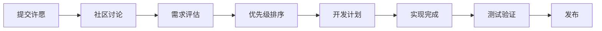

# 贡献指南 (Contributing Guidelines)

感谢您对 QuantAxis NextDay 许愿池的关注！我们欢迎任何形式的贡献和建议。

## 🌟 如何贡献 (How to Contribute)

### 1. 提交许愿 (Submit a Wish)

我们提供了多种许愿模板，您可以根据需求选择：

- **🚀 功能增强许愿**: 新功能需求或现有功能改进
- **🐛 问题修复许愿**: 发现的问题和修复建议
- **📈 策略相关许愿**: 交易策略相关需求
- **💡 创意想法许愿**: 创新想法和建议

### 2. 许愿指南 (Wish Guidelines)

#### 📝 撰写高质量许愿的建议

1. **明确具体**: 清晰描述您的需求，避免模糊表述
2. **提供背景**: 说明为什么需要这个功能或改进
3. **详细说明**: 包含具体的使用场景和期望效果
4. **附加资料**: 提供相关链接、文档或代码示例

#### ✅ 许愿最佳实践

```markdown
好的许愿示例：
标题: 添加布林带策略回测功能
描述: 希望在回测框架中添加布林带策略模板，包括：
- 上轨突破买入信号
- 下轨跌破卖出信号  
- 可配置的参数（周期、标准差倍数）
- 风险控制机制

使用场景: 量化交易员进行布林带策略回测和优化
```

```markdown
需要改进的许愿示例：
标题: 添加新功能
描述: 希望有更多功能

问题: 太模糊，缺乏具体信息
```

### 3. 许愿生命周期 (Wish Lifecycle)



#### 标签说明 (Label Descriptions)

- `wish`: 所有许愿的基础标签
- `enhancement`: 功能增强类许愿
- `bug`: 问题修复类许愿
- `strategy`: 策略相关许愿
- `idea`: 创意想法类许愿
- `priority-high`: 高优先级
- `priority-medium`: 中优先级
- `priority-low`: 低优先级
- `in-discussion`: 讨论中
- `accepted`: 已接受
- `in-progress`: 开发中
- `completed`: 已完成

### 4. 社区互动 (Community Interaction)

#### 参与讨论
- 在许愿下方评论，提供更多信息或建议
- 为有价值的许愿点赞 👍
- 分享相关经验和资源

#### 协作开发
- 如果您有能力实现某个许愿，欢迎提交 Pull Request
- 提供代码示例或解决方案
- 协助测试和验证新功能

### 5. 技术贡献 (Technical Contributions)

如果您想直接贡献代码，请遵循以下步骤：

1. Fork 本仓库
2. 创建功能分支 (`git checkout -b feature/amazing-feature`)
3. 提交更改 (`git commit -m 'Add some amazing feature'`)
4. 推送分支 (`git push origin feature/amazing-feature`)
5. 创建 Pull Request

#### 代码规范
- 遵循 Python PEP 8 代码风格
- 添加必要的注释和文档
- 包含测试用例
- 确保向后兼容性

### 6. 许愿评估标准 (Wish Evaluation Criteria)

我们会根据以下标准评估许愿：

1. **用户价值**: 对用户的实际价值和影响
2. **技术可行性**: 实现的技术难度和可行性
3. **资源需求**: 所需的开发时间和资源
4. **战略契合**: 与项目整体方向的契合度
5. **社区反馈**: 社区的关注度和支持度

### 7. 联系我们 (Contact Us)

如果您有任何问题或需要帮助：

- 📧 通过 GitHub Issues 联系
- 💬 参与 GitHub Discussions
- 🔍 查看已有的许愿和讨论

### 8. 行为准则 (Code of Conduct)

我们致力于为所有参与者创造一个友好、包容的环境：

- 尊重不同观点和经验
- 接受建设性批评
- 专注于对社区最有利的事情
- 对其他社区成员表现出同理心

---

**感谢您的贡献！每一个许愿都让 QuantAxis 变得更好。**

*Thank you for your contributions! Every wish makes QuantAxis better.*